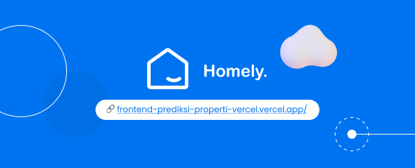

# Tugas Besar II3160 Teknologi Sistem Terintegrasi : Homeely 

**Homeely** merupakan produk yang didasarkan akan Software as a Service(SaaS) yang berkecimpung di dalam pengelolaan properti. Target utama dari Homeely adalah para pemilik porperti ganda yang memiliki keterbatasan dalam mengelolanya, seperti lansia yang memutuskan untuk berinvestasi pada properti namun kesulitan dalam mengontrol dan melakukan pentatan administrasi.

Meskipun target utamanya adalah customer pemilik multi properti, pada Homeely, terdapat dua jenis user yang bisa melakukan akses pada software yang ditawarkan yaitu user owner properti dan user renter properti. User renter properti nantinya akan menggunakan Homeely untuk mengisikan data diri mereka agar bisa langsung terkoneksi ke dalam database yang dimiliki oleh pemilik properti.  

## Deployment

Aplikasi dari tugas besar ini sudah bisa langsung diakses pada tautan berikut 

**Frontend & Main Link**

https://frontend-prediksi-properti-vercel.vercel.app/ 

username : username, password : password

**Backend FastAPI**

https://prediksi-properti-railway-production.up.railway.app/docs

## Authors

- [@18221104 Karina Rahadiani](https://www.github.com/karinarahadiani)

## Documentation

[Documentation](https://bit.ly/LaporanHomeely)

## Demo

